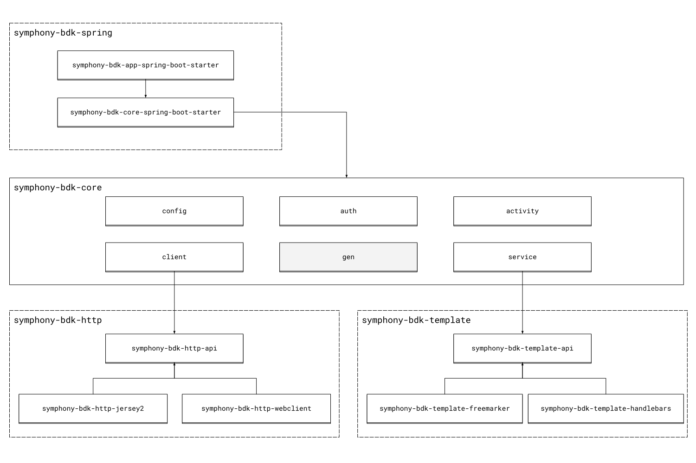

# BDK Architecture Presentation
The Symphony BDK for Java is a multi-module library that uses [Gradle](https://gradle.org/) as build system. 
This page will help to clearly understand how the library has been designed. This can be also useful for new contributors
aiming to provide additional features or implementations. 

## Architecture Overview
The following diagram aims to give an overview of the different layers and modules provided by the BDK library.

### symphony-bdk-core
The `symphony-bdk-core` is the main module that allows developers to write bots from a pure Java main application. It contains
all necessary BDK features such as: 
- [configuration](../configuration.md) 
- [authentication](../authentication.md)
- [datafeed](../datafeed.md)
- services
- [activity API](../activity-api.md)

#### Code Generation
The `symphony-bdk-core` module relies on the [openapi-generator-maven-plugin](https://github.com/OpenAPITools/openapi-generator/blob/master/modules/openapi-generator-maven-plugin/README.md)
to generate API clients and models from official Symphony's [Swagger specifications](https://github.com/symphonyoss/symphony-api-spec).
API's clients are located under package `com.symphony.bdk.gen.api` and models under `com.symphony.bdk.gen.api.model`.

### symphony-bdk-http
The `symphony-bdk-http-api` module defines a generic interface for performing HTTP calls. Along with this interface, it
also provides a utility `com.symphony.bdk.http.api.HttpClient` class helping developers to perform calls to external systems.
> :warning: It is important to notice that interface `com.symphony.bdk.http.api.ApiClient` is used by generated code. 
> Changing contract would break the build.
> [Code Generation](#code-generation) will be detailed later in this page.

At the moment, two different implementations have been created for the `com.symphony.bdk.http.api.ApiClient` interface:
- `com.symphony.bdk.http.jersey2.ApiClientJersey2` contained in module `symphony-bdk-http-jersey2` (default implementation for [Core](#symphony-bdk-core))
- `com.symphony.bdk.http.webclient.ApiClientWebClient` contained in module `symphony-bdk-http-webclient` (default implementation for [Spring Boot](#symphony-bdk-spring))  

### symphony-bdk-template
The `symphony-bdk-template-api` module defines a set of interfaces that allows developers to load and fill text files with 
data. This API is especially useful for complex MessageML templating.

At the moment, two different module implementations have been created: 
- `symphony-bdk-template-freemarker`
- `symphony-bdk-template-handlebars`

### symphony-bdk-spring
The Symphony BDK comes also with two starter modules to ease integration with Spring Boot framework: 
- `symphony-bdk-core-spring-boot-starter` that is basically a wrapper around the [symphony-bdk-core](#symphony-bdk-core) module
- `symphony-bdk-app-spring-boot-starter` that is a foundation for Extension Application backend development
